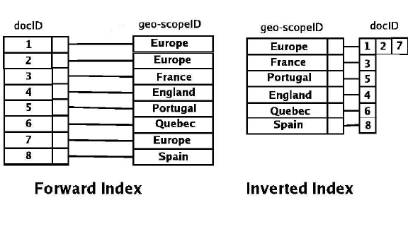

# Elastic Search Hands-on
ElasticSearch 는 2004년 Shay Banon 라는 인물이 Apache Lucene 보완을 계기로 시작된 **검색엔진**이다.
현재는 `Logstash`, `Kibana` 프로젝트를 정식 흡수하여 Elastic Stack 을 함께 개발해 나가고 있다. 

ElasticSearch 는 뛰어난 검색 능력과 대규모 분산 시스템, 쉬운 설치 및 사용 등.. 의 장점을 가지고 있다.
또한 실시간 분석이 가능하기 때문에 대용량 데이터 분석에도 널리 쓰인다.

`Full Text` 검색 엔진이며 역파일 색인 구조로 저장된다. 
또한 key-value 형식이 아닌 문서 기반으로 복합적인 정보를 포함하는 형식의 문서를 있는 그대로 저장 가능하다.

이 외에도 RESTFul API 를 통해 데이터 조회, 입력, 삭제 등..을 처리하며, 멀티테넌시 환경을 가지고 있다.
Index 라는 논리적인 집합 단위로 구성되어 분산 저장되기 때문에 별도의 커넥션 없이 하나의 질의로 묶어 검색하고, 하나의 출력으로 도출 할 수 있다.

## Inverted Index
문서에서 검색의 될 만한 것들의 존재여부와 위치를 미리 추출하여 빠른 검색을 할 수 있도록 하는 것을 색인 <sub>Forward Index</sub> 이라 한다. 
반면, <b>역색인 <sub>Inverted Index</sub></b> 은 검색될 만한 단어에서 어떤 문서에서 등장했는지 기록하여 단어를 통해 검색하는 방식이다.

 ** 위에서 등장한 `검색될 만한 단어` 는 Elastic Search 에서 `Term` 이라 부른다. 

   
<sup> <https://www.researchgate.net/figure/The-geographic-scopes-inverted-index-The-inverted-index-is-used-for-fast-document_fig3_266863129> </sup>

RDBMS 에서 텍스트로 데이터를 검색하기 위해 LIKE 연산을 사용한다. 
이때, 모든 데이터를 순회하며 패턴 매칭을 시도하여 매칭이 된 데이터만 추출될 것이다. 
이러한 방식은 빠른 검색을 요하는 검색엔진에는 적합하지 않다. 
그렇기 때문에 Elasitc Search 에서는 역색인 방식을 채택하여, 
모든 데이터를 순회하지 않고도 특정 키워드에 대한 문서를 빠르게 찾을 수 있도록 하였다.

## Install with Docker
ElasticSearch Docker 이미지는 [공식 홈페이지](https://www.docker.elastic.co/r/elasticsearch)에서 배포하고 있으며 
[가이드](https://github.com/elastic/elasticsearch)도 제공해주고 있다. 
또한 오픈소스 이기 때문에 [Github](https://github.com/elastic/elasticsearch)을 통해서 소스코드도 볼 수 있다.

``` shell
> docker pull docker.elastic.co/elasticsearch/elasticsearch:<버전>
> docker network create elastic
> docker run --name es01 --net elastic -p 9200:9200 -p 9300:9300 -it docker.elastic.co/elasticsearch/elasticsearch:<버전>
```

ElasticSearch 를 실행하면 아래와 같이 인증서 파일이 생성된다. 인증서를 추출하여 아래와 같이 curl 을 통해 요청을 보낼 수 있다.
``` shell
> docker cp <컨테이너 이름>:/usr/share/elasticsearch/config/certs/http_ca.crt . --name <유저 이름>
> curl --cacert http_ca.crt -u <유저 이름> https://localhost:9200
```

> 위와 같이 curl 을 통해 요청을 보내면 패스워드를 요구한다. 이는 아래 명령을 통해서 패스워드 재설정이 가능하다.
> ``` shell 
> > docker exec -it es01 /usr/share/elasticsearch/bin/elasticsearch-reset-password --username elastic  
> ```

`ES_JAVA_OPTS` option 을 통해, `-Xms`와 `-Xmx`를 설정하여 JVM Heep 크기를 지정해 줄 수 있다.
```
docker run -e ES_JAVA_OPTS="-Xms1g -Xmx1g" ...
```

## CRUD
위에서 언급함과 같이 ElasticSearch 는 RESTful, JSON 으로 정보를 주고 받는다. 또한 저장하는 방식도 JSON 방식으로 저장한다.   

> Elastic Stack 중 Kibana 는 Postman 과 같이 Rest API 를 쉽게 실행 할 수 있는 Dev Tools 라는 도구를 제공한다.
> ```shell
> > docker pull docker.elastic.co/kibana/kibana:8.7.0
> > docker run --name kib-01 --net elastic -p 5601:5601 docker.elastic.co/kibana/kibana:<버전>
> 
> ...
> 
> i Kibana has not been configured.
> 
> Go to http://0.0.0.0:5601/?code=247418 to get started.
> 
> Your verification code is:  247 418
> ```
> 실행 후 log 로 나타난 url 로 접속하여 초기 세팅 후 Kibana 를 사용 할 수 있다. 
> 초기 세팅에서 Cluster 의 Enrollment Token 과 ElasticSearch 의 계정을 입력하여야한다.
> 이는 ElasticSearch 실행 시 나타나는 log 에서 확인 할 수 있으며, 
> `bin/elasticsearch-reset-password` 또는 `bin/elasticsearch-create-enrollment-token` 를 통해 재성성 및 재설정이 가능하다.   
> 
> 만약 초기 설정까지 완료하였다면 왼쪽 메뉴 중 Management > Dev Tools 로 이동하여 사용이 가능하다.

ElasticSearch 에서는 도큐먼트별로 고유한 URL을 갖는다. 
7 버전 이상에서는 `<index>/_doc/<document id>` 와 같은 구조이며 6.x 버전 이전은 `<index>/<document type>/<document id>` 와 같은 구조를 가진다.

### Create & Update
`POST` Method 를 사용하여 데이터를 추가 할 수 있다. `<index>/_doc/<document id>` 형태의 url 로 아래와 같이 json 형태의 데이터를 함깨 보내면 
데이터를 정한다. 만약 뒤에 Document Id 를 생략하면 자동으로 생성하여 Response 로 반환해준다.
```http request
POST this_is_index/_doc
{
  "this_is_key": "create data",
  "test": "create data like this"
}
```
```http response
{
  "_index": "this_is_index",
  "_id": "d-58a4cBR_iNTmD8WHEW",
  "_version": 1,
  "result": "created",
  "_shards": {
    "total": 2,
    "successful": 1,
    "failed": 0
  },
  "_seq_no": 5,
  "_primary_term": 1
}
```

위에서 생성된 데이터를 수정하려면 `_update`를 사용하면된다. `<index>/_update/<document id>` 형태로 POST 요청을 보냄으로써 수정을 요청 할 수 있다.
수정 또는 추가하고자 하는 내용을 `doc`에 넣으면 Document Id 에 해당하는 값이 바뀐다. 추가적으로 결과 값을 보면 수정 횟수에 따라 _version 이 카운팅 된다.
```http request
POST this_is_index/_update/d-58a4cBR_iNTmD8WHEW
{
  "doc": {
    "this_is_key": "this_is_value",
    "info": {
      "name":"Junny Kym",
      "message":"Hello, ElasticSearch!"
    }
  }
}
```
```http response
{
  "_index": "this_is_index",
  "_id": "d-58a4cBR_iNTmD8WHEW",
  "_version": 2,
  "result": "updated",
  "_shards": {
    "total": 2,
    "successful": 1,
    "failed": 0
  },
  "_seq_no": 14,
  "_primary_term": 1
}
```

`POST` Method 외 `PUT` Method 또한 데이터 삽입, 수정이 가능하다. 
단, `PUT` 으로 데이터 생성 할 때는 Document Id 자동생성이 안되며, 
`POST` 에서는 `_update` 를 사용할 수 있었지만 `PUT` 에서는 `_create` 를 통해 데이터를 생성하는 기능이 존재한다. 

`PUT` 에서는 아래와 같은 URL 이 삽입, 수정 기능 둘 다 제공한다.
```http request
PUT foo/_doc/1
{
  "this_is_key": "this_is_value",
}
```
```http response
{
  "_index": "foo",
  "_id": "3",
  "_version": 2,
  "result": "updated",
  "_shards": {
    "total": 2,
    "successful": 1,
    "failed": 0
  },
  "_seq_no": 1,
  "_primary_term": 1
}
```

아래와 같이 `_create`를 사용해서 데이터를 생성 할 수도 있다. 다만, 같은 Document Id 가 존재한다면 409 conflict 에러가 발생한다. 
```http request
PUT foo/_create/2
{
  "this_is_key": "this_is_not_value",
}
```
```http response
{
  "_index": "foo",
  "_id": "2",
  "_version": 1,
  "result": "created",
  "_shards": {
    "total": 2,
    "successful": 1,
    "failed": 0
  },
  "_seq_no": 3,
  "_primary_term": 1
}
```

### Read
앞써 생성한 데이터를 조회하고 싶다면 `GET` 형태로 아래와 같이 요청을 보내면 된다.
```http request
GET this_is_index/_doc/d-58a4cBR_iNTmD8WHEW
```
```http response
{
  "_index": "this_is_index",
  "_id": "d-58a4cBR_iNTmD8WHEW",
  "_version": 2,
  "_seq_no": 14,
  "_primary_term": 1,
  "found": true,
  "_source": {
    "this_is_key": "this_is_value",
    "test": "create data like this",
    "info": {
      "name": "Junny Kym",
      "message": "Hello, ElasticSearch!"
    }
  }
}
```

### Delete
삭제 또한 간단하다. `DELETE` 형태의 요청을 보냄으로써 데이터를 삭제 할 수 있다. 
다만, 뒤에 Doucment Id 를 붙이지 않으면 전체 삭제, 붙이면 특정 데이터를 삭제한다.
```http request
DELETE this_is_index/_doc/d-58a4cBR_iNTmD8WHEW
```
```http response
{
  "_index": "this_is_index",
  "_id": "d-58a4cBR_iNTmD8WHEW",
  "_version": 2,
  "result": "deleted",
  "_shards": {
    "total": 2,
    "successful": 1,
    "failed": 0
  },
  "_seq_no": 15,
  "_primary_term": 1
}
```
또는 아래와 같이 전체삭제를 할 수 있다.
```http request
DELETE this_is_index
```
```http response
{
  "acknowledged": true
}
```

### Bulk

ElasticSearch 는 bulk 작업을 수행하기 위한 API 를 제공한다. `POST _bulk` 를 통해 사용가능하며, 
`index`, `create`, `update`, `delete` 동작을 수행 할 수 있다. 
각 동작들은 아래와 같이 `{ <동작> : { <부가정보>... } }` 와 같은 형태로 사용한다.

`index` 는 create, update 작업을 수행하며, 
만약 `create` 를 사용하면 update 를 사용하지 못하고 `update` 를 사용하게되면 create 를 하지 못한다.
따라서 아래 요청을 보내면 마지막 Update 는 id 가 1 인 Document 가 존재하지 않기 때문에 
결과 값으로 `error: true` 와 Document 를 찾지 못했다는 메시지가 전달된다.

```http request
POST _bulk
{"index": {"_index": "test-index","_id": 0}}
{"field": "this is field data"}
{"index": {"_index": "test-index","_id": 0}}
{"field": "this is changed field data"}
{"delete": {"_index": "test-index","_id": 0}}
{"create": {"_index": "test-index","_id": 0}}
{"field": "this is recreated field"}
{"update": {"_index": "test-index","_id": 1}}
{"doc":{"field":"this is updated field"}}
```

> Bulk API 를 사용할 때 주의할 점은 아래와 같이 여러줄에 걸쳐 입력할 경우 API 가 작동하지 않는다.
> 그렇기 때문에 위와 같이 json 을 한줄로 입력해주어야한다.
> ```http request
>  POST _bulk
> {
>     "index": {
>         "_index": "test-index",
>         "_id": 0
>     }
> }
> {
>     "field": "this is field data"
> }
> ...
> ```
> ```http response
> 500 - Internal Server Error
> ...
> JsonEOFException
> ```

## Search 

ElasticSearch 는 데이터 검색을 위해 검색어인 `Term` 으로 분석 과정을 거쳐 저장된다. 
따라서 대소문자, 단수, 복수, 원형 여부와 상관없이 검색 가능하며 이를 `Full Text Search` 라고한다. 

> Query DSL <sub>Domain Specific Language</sub>   
> ElasticSearch 에서 검색을 위한 쿼리 기능.

검색 기능은 `GET <index>/_search` 에 요청을 보내 검색 쿼리를 사용할 수 있으며, 아래와 같은 형태로 사용 할 수 있다.
```http request
GET <index>/_search
{
    "query": {
        쿼리 내용 ...
    }
}
```

Full Text Query 는 `match_all`, `match`, `match_phrase` 가 있다.

### match_all
match_all 은 인덱스의 모든 도큐먼트를 검색할 때 사용한다. 
아래와 같이 body 를 작성하여 검색 할 수도 있으며, 
body 를 생략하여 `GET <index>/_search` 를 홀출하였을 때 match_all 로 검색이 된다.

```json
{
    "query": {
        "match_all": {}
    }
}
```

### match
match 는 full text query 에 사용되는 가장 일반적인 쿼리이며, 아래와 같이 사용 할 수 있다.

```json
{
    "query": {
        "match": {
            "message": {
                "query": "<검색 내용>",
                "operator": "and"  
            }
        }
    }
}
```

`query` 의 값을 통해 검색을 한다. `operator` 에 `or 또는 and` 를 지정할 수 있다.

만약 operator 에 or 조건을 지정하였다면 query 에 들어간 단어 중 하나만 포함되어도 검색된다. 
반대로 and 조건을 지정하면 query 에 들어간 모든 단어가 포함되어야 검색이 된다.

여기서 검색된 얼마나 연관성이 있냐에 따라 Document 는 Score 가 매겨지는데 Score 가 높은순으로 결과값이 매겨진다.

operator 는 생략 할 수 있는데, 생략 시 default 로 or 조건으로 검색하게 된다.   
만약 operator 를 생략 할 시, 단순 operator 값을 없애도 되지만 아래와 같이 `message: <검색 내용>` 형태로 입력해도 API 가 작동한다.

```json
{
    "query": {
        "match": {
            "message": "<검색 내용>"
        }
    }
}
```

### match_phrase 
match 를 사용하여 "Hello elastic search" 을 AND 조건으로 검색하면 "Search Elastic Hello" 와 같이 순서가 반대로 되어도 붙어있기만 하면 검색이 된다.
만약 순서까지 고려하여 검색을 하고싶다면 `match_phrase` 를 사용하면 된다.

```json
{
    "query": {
        "match_phrase": {
            "message": "<검색 내용>",
        }
    }
}
```

match_phrase 검색에는 `slop` 라는 옵션을 제공하는데 이는 검색 내용 중간에 n개의 단어가 들어갈 수 있도록 하용해주는 것이다.
만약 slop 를 2 로 지정하여 "Hello elastic search" 를 검색하였다면, "Hello, This is Elastic Search" 와 같은 결과값도 얻을 수 있다.

```json
{
    "query": {
        "match_phrase": {
            "message": "<검색 내용>",
            "slop": 1
        }
    }
}
```

### query_string
query_string 를 사용하여 위 내용을 좀 더 복잡하게 조합 할 수 있다.   

아래와 같이 `AND`, `OR` 키워드를 사용하여 조건을 넣을 수 있으며, `\"<검색 내용>\"` 과 같은 형식으로 match_phrase 를 사용 할 수 있다. 

````json
{
    "query": {
        "query_string": {
            "default_field": "message",
            "query": "(hello OR bye) AND (elastic OR \"elastic search\")"
        }
    }
}
````